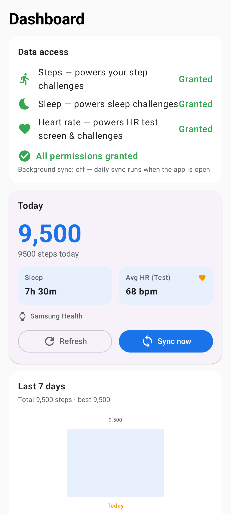
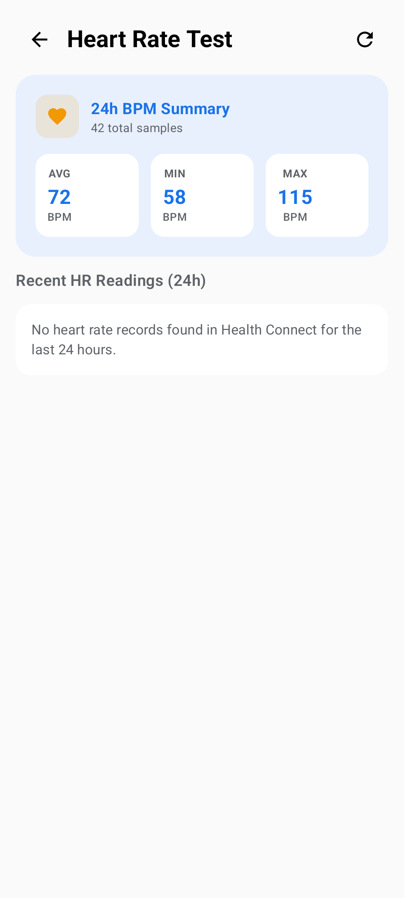
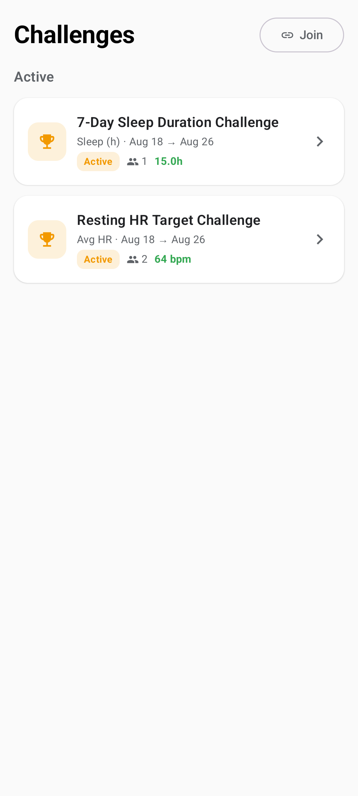
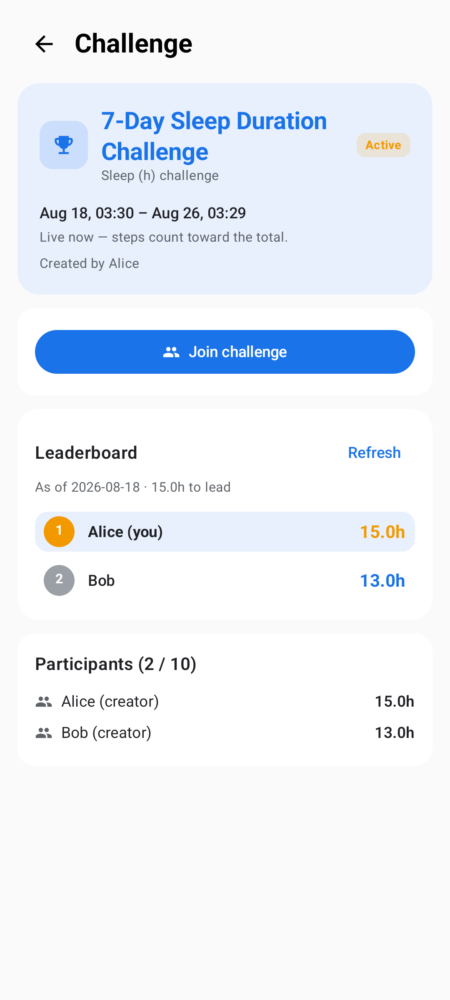
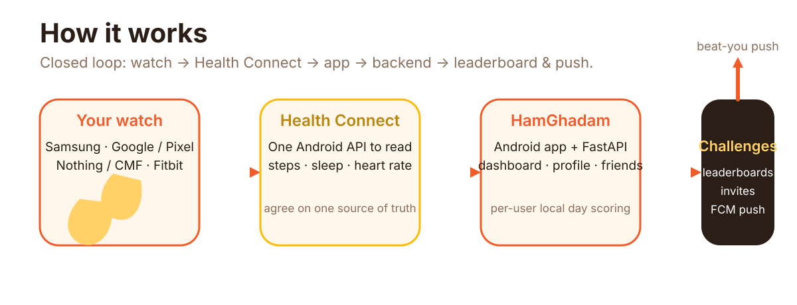

<p align="center">
  
</p>

<p align="center">
  <strong>همقدم</strong> — "walking in step together". One Android app that unifies health data from every watch ecosystem you own, then turns daily movement into friendly challenges.
</p>

<p align="center">
  <a href="#why-hamghadam"></a>
  <a href="#proof"></a>
  <a href="#how-it-works"></a>
  <a href="#roadmap"></a>
</p>

---

## Why HamGhadam

Your Samsung watch logs steps. Your Pixel watch logs heart rate. Your Fitbit tracks sleep. Google Fit and Samsung Health each speak their own dialect — so you end up with five apps and no single answer to *"how did I actually do today?"*

HamGhadam solves that with **one source of truth**: it reads every ecosystem through Android's Health Connect, stores scores on a backend you own, and lets you and your friends race toward the same goal.

- **Truly cross-ecosystem** — Samsung, Google/Pixel, Nothing/CMF, and Fitbit watches all feed Health Connect; HamGhadam reads them all.
- **Compliance-ready by design** — v1 asks for exactly the permissions it uses (steps only), so the Play listing can be honest from day one.
- **Privacy-sane scoring** — "day" means *your* local day, and anti-cheat means only Health Connect-synced data counts.

---

## Proof

Real screens from the v1.1 release — dashboard with sleep + heart rate, the HR test screen, challenges, and an active leaderboard.

<p align="center">
  
  
  
  
</p>

---

## What it is

A **full-stack fitness companion**: a Kotlin + Jetpack Compose Android app, a FastAPI + Postgres backend, and a deployment bundle that runs on a Raspberry Pi 5 behind Nginx Proxy Manager — your data, your server.

**v1 launched** with steps-only challenges. **v1.1** added sleep duration and heart rate to the dashboard, plus sleep/HR challenge types. **v1.2 (in progress)** is adding Google Sign-In, user profiles (avatar + bio), and a friends list.

| Path | What lives there |
|------|------------------|
| `android/` | Android app — Health Connect read, daily sync, dashboard, challenges UI, FCM push, deep links |
| `backend/` | FastAPI + Postgres — JWT auth, daily ingest, challenges CRUD + leaderboards, invites, FCM push service |
| `deploy/` | Production bundle — `docker-compose.prod.yml`, `.env.prod.example`, `DEPLOY.md` runbook |
| `docs/` | Research briefs and QA reports with evidence screenshots |
| `branding/` | Logo source (SVG) and brand palette |
| `secrets/` | ⚠️ Never committed — Firebase service account + google-services.json live here locally |

---

## How it works

<p align="center">
  
</p>

1. **Your watch** (Samsung, Pixel, Nothing/CMF, Fitbit) syncs to **Health Connect** — Android's unified health store, which has been bidirectional with Samsung Health since v6.22.5.
2. **HamGhadam reads** steps, sleep and heart rate from Health Connect with the user's explicit consent.
3. **The backend** (FastAPI + Postgres, Dockerized) stores daily scores per user-local day, runs challenge leaderboards, and fires FCM push notifications on challenge start/end and "beat-you" moments.
4. **Friends** join challenges by invite link or join code; deep links open the right screen straight from a push.

Key design decisions (v1): Android-only · steps-first challenges with a metric-extensible schema (`sleep_seconds`, `avg_hr` live to be played) · free launch with a `premium` flag for later.

---

## Roadmap

| Version | Status | What ships |
|---------|--------|------------|
| **v1** | ✅ shipped | Steps-only challenges, leaderboards, invites, FCM push, deep links, Play-compliance pack |
| **v1.1** | ✅ shipped | Sleep + heart rate on dashboard, HR test screen, sleep/HR challenge types |
| **v1.2** | 🚧 in progress | Google Sign-In, user profiles (avatar, bio), friends list |
| **v2 idea** | 🧭 future | Wear OS companion app, more challenge metrics, premium |

---

## Build & run

### Android app

```bash
cd android
./gradlew assembleDebug          # or assembleRelease for a signed build
# Debug builds point at http://10.0.2.2:8000/api/v1 (emulator loopback).
# Release builds use BuildConfig.DEFAULT_BASE_URL — set it to your public backend.
```

### Backend

```bash
cd backend
uv venv .venv --python 3.11
uv pip install -r requirements.txt -r requirements-dev.txt
export DATABASE_URL="sqlite:///./fitness.db"   # dev fallback; Postgres in prod
env -u PYTHONPATH .venv/Scripts/python.exe -m alembic upgrade head
env -u PYTHONPATH .venv/Scripts/python.exe -m uvicorn app.main:app --reload
```

Or deploy the full stack with Docker (the live production shape):

```bash
cd deploy
cp .env.prod.example .env        # then set SECRET_KEY etc.
docker compose -f docker-compose.prod.yml up -d --build
# API on http://<host>:8008/healthz — see DEPLOY.md for the NPM + TLS runbook
```

### Tests

```bash
cd backend
env -u PYTHONPATH .venv/Scripts/python.exe -m pytest -v
cd ../android && ./gradlew test && ./gradlew lintDebug
```

---

## Public endpoint

```
https://api.hamghadam.ba4b0d.ir/api/v1
```

Runs on a Raspberry Pi 5 (Docker Compose, `postgres:16-alpine` + `python:3.11-slim`) behind Nginx Proxy Manager with a Let's Encrypt certificate. Full runbook: [`deploy/DEPLOY.md`](deploy/DEPLOY.md).

---

## License & hygiene

- **Secrets:** Firebase private keys must never be committed — `secrets/` is gitignored; `.env` files carry only placeholders.
- This is a personal project — no license is attached yet. Reach out if you'd like to build on it together.

> **Walk together.** That's the whole idea.