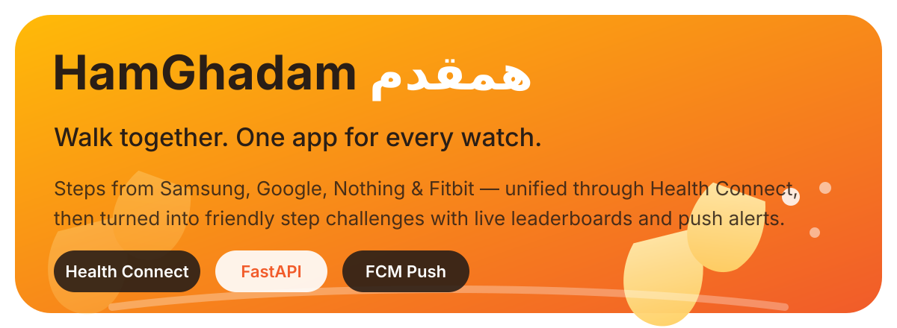
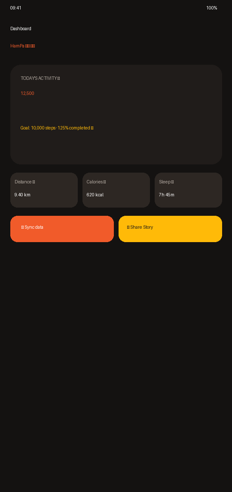
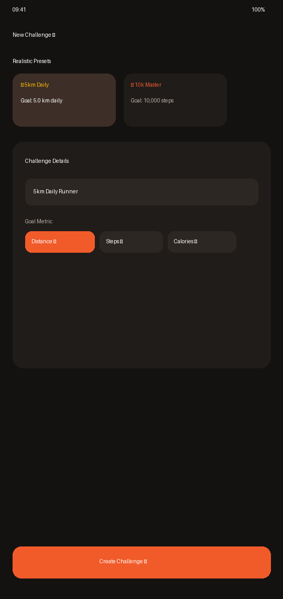
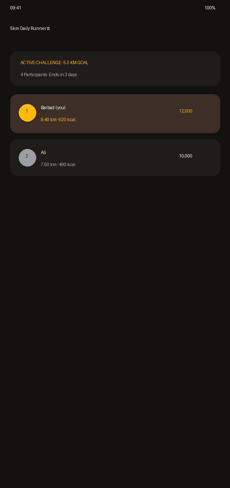

<p align="center">
  
</p>

<p align="center">
  <strong>هم پا</strong> — "walking in step together". One Android app that unifies health metrics from Samsung, Pixel, Fitbit and Nothing watches via Health Connect, then turns daily movement into friendly social challenges.
</p>

<p align="center">
  
  
  
</p>

---

## 🌟 Why HamPa

Your Samsung watch logs steps. Your Pixel watch logs heart rate. Your Fitbit tracks sleep. Google Fit and Samsung Health each speak their own dialect — so you end up with five apps and no single answer to *"how did I actually do today?"*

HamPa solves that with **one source of truth**: it reads every watch ecosystem through Android's **Health Connect**, stores scores on a server you own, and lets you and your friends race toward the same goal.

- 👟 **Truly Cross-Ecosystem:** Samsung, Google/Pixel, Nothing/CMF, and Fitbit watches all feed Health Connect; HamPa reads them all.
- 🏃 **Distance & Calorie Competitions:** Race in **Distance (km)**, **Calories (kcal)**, or **Steps (👟)** with live leaderboards.
- ⚡ **1-Tap Quick Presets:** Launch 5km Daily Runner, 10k Steps, 600 kcal Burner, or Early Bird Morning Walk in 1 tap.
- 📲 **Instagram & Telegram Story Cards:** Generate and share 9:16 progress story cards with 1 tap.
- 🔔 **Real-Time Push Alerts:** FCM notifications for friend requests, acceptances, and leaderboard overtakes.
- 🌙 **Material3 Dark Mode:** System-matching dark charcoal design system.
- 🛡️ **Privacy & Account Compliance:** Built-in account & data deletion (`DELETE /users/me`).

---

## 📸 Screenshots & Showcase

<p align="center">
  
  
  
</p>

---

## 🏗️ Architecture & Stack

| Layer | Technology | Details |
|-------|------------|---------|
| **Android Client** | Kotlin, Jetpack Compose, Material3 | Health Connect API, FCM push, custom canvas story generator |
| **Backend API** | FastAPI, Python 3.11, SQLAlchemy, PyJWT | OAuth2 token verification, daily ingest, FCM push service |
| **Database** | PostgreSQL 16 | Multi-tenant schema with CASCADE data retention |
| **Deployment** | Docker Compose, Raspberry Pi 5 | Hosted on host port 8008 behind Nginx Proxy Manager with SSL |

---

## 🚀 Quick Start

### Android App
```bash
cd android
./gradlew assembleRelease
# Output: android/app/build/outputs/apk/release/HamPa-v0.7.0.apk
```

### Backend (Docker Compose)
```bash
cd deploy
docker compose -f docker-compose.prod.yml up -d --build
# Endpoint: https://api.hamghadam.ba4b0d.ir/api/v1
```

---

## 📦 Releases

Latest APK builds and detailed release notes are available on **[GitHub Releases](https://github.com/ba4b0d/hamghadam/releases)**.

---

<p align="center">
  <a href="https://github.com/oil-oil/beautify-github-readme"></a>
</p>
